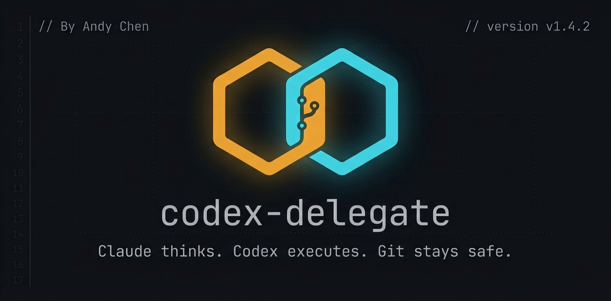

<p align="center">
  
</p>

# codex-delegate

**The lightweight Claude Code + Codex CLI collaboration plugin.**

> Zero dependencies. Pure Bash. Git-safe. Battle-tested on Windows.

**English** | [中文](README.zh-CN.md)

Claude thinks. Codex executes. Neither steps on the other's work.

---

## Why This Plugin?

Claude Code has **no built-in Codex integration**. You can run `codex exec` via Bash, but that's a raw subprocess with no safety net — no git protection, no output capture, no timeout, no structured handoff.

OpenAI ships an [official plugin](https://github.com/openai/codex-plugin-cc) (`codex-plugin-cc`), but it's a heavy Node.js/TypeScript stack with 15+ library files, an app-server broker layer, and `npm install` required.

**codex-delegate** takes a different approach: **3 Bash scripts, 1 skill, 1 command. That's it.** No build step. No runtime dependencies. Clone and go.

### Comparison

| | Raw Bash | OpenAI Official Plugin | **codex-delegate** |
|---|---|---|---|
| **Install complexity** | N/A | `npm install` + app server | Clone only |
| **Runtime deps** | None | Node.js 18+ | None (pure Bash) |
| **Git safety** | None | None | Auto-stash, HEAD record, rollback info |
| **Timeout protection** | None | None | Configurable `CODEX_TIMEOUT` |
| **Interrupt safety** | None | None | `trap` cleanup + stash warning |
| **Test-fix cycle** | Manual | None | Built-in (run → fix → re-run, max N rounds) |
| **Collaboration modes** | None | None | Cautious / Quick / Diagnosis |
| **Delegation judgment** | None | Basic | Teaches Claude WHEN to delegate, not just HOW |
| **Output capture** | stdout only | Structured | `-o` file + stdout dual-channel |
| **Background jobs** | Manual | `/codex:status/result/cancel` | Via Claude Code native |
| **Adversarial review** | None | `/codex:adversarial-review` | Via review prompt customization |
| **Review gate (Stop hook)** | None | Built-in | Not included |
| **Session resume** | Manual | `--resume` | Not included |
| **Windows tested** | Fragile | Unknown | Tested on Windows 11 + Git Bash |
| **Bilingual** | No | English only | Chinese + English triggers |
| **Codebase size** | 0 | ~3000 lines (TS/MJS) | ~300 lines (Bash) |

### Where codex-delegate wins

**1. Git Safety — No Other Plugin Does This**

Every Codex invocation is wrapped in a safety harness:
- Pre-flight: detect dirty working tree → auto-stash with timestamp tag
- Record HEAD for rollback reference
- Post-flight: print `git diff --stat`, new files, rollback commands
- On interrupt: `trap` ensures stash warning is printed, temp files cleaned

**2. Test-Fix Cycle — A Dedicated Workflow**

`run-codex-testfix.sh` automates the most tedious debugging loop:
```
Round 1: run tests → 4 failures → Codex fixes → re-run
Round 2: 1 failure remains → Codex fixes → re-run
Round 3: all pass ✓
```
No other Codex plugin has this as a first-class feature.

**3. Collaboration Modes — Claude Stays In Control**

| Mode | Flow | When |
|------|------|------|
| **Cautious** (default) | Codex proposes (read-only) → Claude reviews → Codex executes | Multi-file changes, unfamiliar code |
| **Quick** | Codex executes directly | Simple renames, formatting |
| **Diagnosis** | Codex reads only, Claude decides | Bug investigation |

The official plugin has "rescue" (fire-and-forget delegation). codex-delegate has a **review checkpoint** before execution.

**4. Lightweight & Portable**

```
codex-delegate/          openai/codex-plugin-cc/
├── scripts/ (3 files)   ├── scripts/lib/ (15 files)
├── skills/ (1 SKILL)    ├── agents/ hooks/ prompts/ schemas/
├── commands/ (1 cmd)    ├── commands/ (7 commands)
└── 300 lines total      └── ~3000 lines + npm deps
```

### Where the official plugin wins

- **Background job management**: `/codex:status`, `/codex:result`, `/codex:cancel` — proper job lifecycle
- **Adversarial review**: Devil's advocate mode that challenges design decisions
- **Review gate**: Stop hook that blocks Claude from completing until Codex approves
- **Session resume**: `--resume` to continue a previous Codex thread

Choose codex-delegate if you want **safety, simplicity, and test-fix automation**.
Choose the official plugin if you want **background job control and review gates**.

---

## Features

| Feature | Description |
|---------|-------------|
| **Smart delegation** | Claude learns WHEN to delegate via SKILL.md — not every task goes to Codex |
| **Git safety harness** | Auto-stash, HEAD recording, diff output, rollback commands, interrupt protection |
| **Test-fix cycle** | Automated run → fix → re-run loop with configurable max rounds |
| **Cross review** | Codex reviews Claude's code independently for bugs, security, performance |
| **Bug diagnosis** | Read-only analysis mode — Codex investigates, Claude decides |
| **Timeout protection** | Configurable `CODEX_TIMEOUT` (default 300s) prevents indefinite hangs |
| **Dual trigger** | Natural language ("交给 codex") or slash command (`/codex <task>`) |
| **Bilingual** | Chinese + English trigger phrases and documentation |

---

## Install

### Quick Start

```bash
# 1. Register marketplace
/plugin marketplace add Rubbish0-A/codex-delegate

# 2. Install
/plugin install codex-delegate@codex-delegate

# 3. Reload
/reload-plugins
```

### Prerequisites

- [Codex CLI](https://github.com/openai/codex) installed (`npm install -g @openai/codex`)
- OpenAI API key or ChatGPT subscription configured in Codex
- Git (for safety features)

> Full setup guide with API proxy configuration: [`skills/delegate-to-codex/references/setup-guide.md`](skills/delegate-to-codex/references/setup-guide.md)

---

## Usage

### Natural Language

```
"把这个登录接口的参数校验交给 codex 实现"
"让 codex 修一下 src/auth/ 下面的测试"
"用 codex review 一下当前的改动"
"codex 查一下这个接口为什么返回 500"
```

### Slash Command

```bash
/codex implement user registration with input validation
/codex fix the failing tests in src/auth/
/codex review
/codex review check for SQL injection vulnerabilities
```

### Workflow Examples

**Cross Review (Claude writes → Codex reviews)**
```
You: "帮我实现用户注册接口"
Claude: [writes code]
Claude: "代码写完了，要不要让 Codex 做个交叉审查？"
You: "好"
→ Codex reports 2 HIGH + 3 MEDIUM issues
→ Claude analyzes each finding with you
```

**Test-Fix Cycle**
```
You: "测试跑不过，让 codex 修一下"
→ Round 1: 4 failures → Codex fixes → re-run
→ Round 2: 1 failure → Codex fixes → re-run  
→ Round 3: All pass ✓
→ Claude reviews the fixes before reporting
```

**Bug Diagnosis (read-only)**
```
You: "这个接口返回 500，让 codex 查一下"
→ Codex reads code without modifying anything
→ Reports: root cause is unhandled null in db.query()
→ Claude evaluates and discusses fix options with you
```

---

## Architecture

```
┌──────────────────────────────────────────────┐
│                  User                         │
│  "交给 codex"  /  /codex <task>              │
└─────────────────┬────────────────────────────┘
                  │
                  ▼
┌──────────────────────────────────────────────┐
│            Claude (Brain)                     │
│                                               │
│  SKILL.md teaches:                            │
│  • WHEN to delegate (judgment criteria)       │
│  • HOW to delegate (collaboration modes)      │
│  • Conflict prevention rules                  │
│  • Post-delegation verification               │
└─────────────────┬────────────────────────────┘
                  │ Bash tool
                  ▼
┌──────────────────────────────────────────────┐
│         Safety Scripts (Bash)                 │
│                                               │
│  Pre-flight:                                  │
│  ✓ codex CLI check                            │
│  ✓ git stash uncommitted changes              │
│  ✓ record HEAD for rollback                   │
│                                               │
│  Execute:                                     │
│  ✓ timeout protection (CODEX_TIMEOUT)         │
│  ✓ stdin closed (< /dev/null)                 │
│  ✓ output captured (-o file + stdout)         │
│                                               │
│  Post-flight:                                 │
│  ✓ git diff --stat                            │
│  ✓ rollback commands                          │
│  ✓ stash restore reminder                     │
│                                               │
│  On interrupt:                                │
│  ✓ trap cleanup (temp files + stash warning)  │
└─────────────────┬────────────────────────────┘
                  │
                  ▼
┌──────────────────────────────────────────────┐
│          Codex CLI (Hands)                    │
│                                               │
│  codex exec --full-auto --ephemeral          │
│  Sandboxed execution (workspace-write)        │
│  Results returned to Claude                   │
└──────────────────────────────────────────────┘
```

---

## Configuration

### Environment Variables

| Variable | Default | Description |
|----------|---------|-------------|
| `CODEX_TIMEOUT` | `300` (task/review), `600` (testfix) | Max seconds before killing Codex process |

### Codex Model / Effort

Edit `~/.codex/config.toml`:

```toml
model = "gpt-5.4"
model_reasoning_effort = "xhigh"
```

---

## Plugin Structure

```
codex-delegate/
├── .claude-plugin/
│   ├── plugin.json              # Plugin manifest
│   └── marketplace.json         # Marketplace discovery
├── commands/
│   └── codex.md                 # /codex slash command
├── skills/
│   └── delegate-to-codex/
│       ├── SKILL.md             # Core: teaches Claude delegation logic
│       └── references/
│           ├── codex-cli-reference.md
│           ├── setup-guide.md
│           └── workflow-patterns.md
├── scripts/
│   ├── run-codex-task.sh        # Task execution (full-auto / read-only)
│   ├── run-codex-review.sh      # Code review
│   └── run-codex-testfix.sh     # Test-fix cycle (max N rounds)
└── README.md
```

---

## Troubleshooting

| Problem | Solution |
|---------|----------|
| `[ERROR] codex CLI not found` | `npm install -g @openai/codex` |
| `401 Unauthorized` | Configure `OPENAI_API_KEY` or run `codex login` |
| Codex hangs on stdin | Already fixed in v1.4.1+ (`< /dev/null`) |
| Timeout on large projects | Increase: `export CODEX_TIMEOUT=600` |
| Plugin not loaded | Complete marketplace registration, then `/reload-plugins` |
| Codex made wrong changes | Rollback: `git checkout -- . && git clean -fd` |
| Stash lost after interrupt | Check: `git stash list` — auto-stashes are tagged with timestamps |

---

## Changelog

### v1.4.2 (2026-04-14)
- Add codex CLI pre-flight check
- Add `trap` cleanup for temp files and stash safety on interrupt
- Add configurable timeout (`CODEX_TIMEOUT` env var)
- Convert FLAGS from string to bash array for safe expansion
- Add `-o` output capture to codex review
- Add `SCRIPT_COMPLETED` guard to avoid duplicate stash warnings

### v1.4.1 (2026-04-14)
- Close stdin (`< /dev/null`) on all codex invocations to prevent hang

### v1.4.0
- Flexible collaboration modes (Cautious / Quick / Diagnosis)

### v1.3.0
- Fix plugin discovery, update install guide

### v1.2.1
- Optimize for lightweight, practical, quality

---

## License

MIT

---

**3 scripts. 300 lines. Zero dependencies. Full git safety.**

Made for developers who want Claude and Codex to collaborate — without the complexity.
